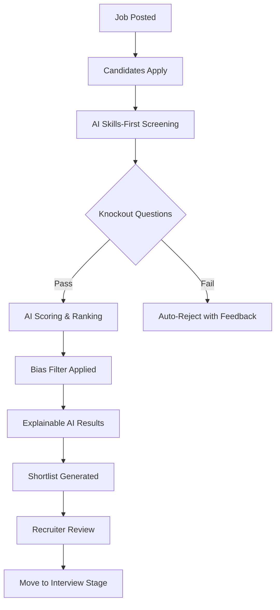
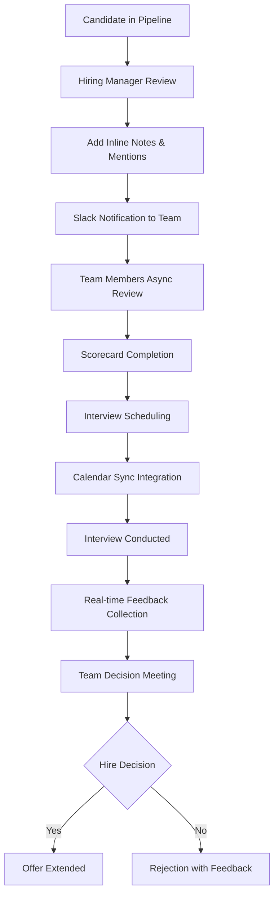
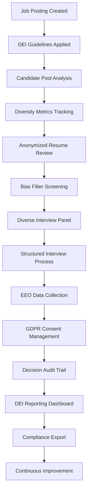
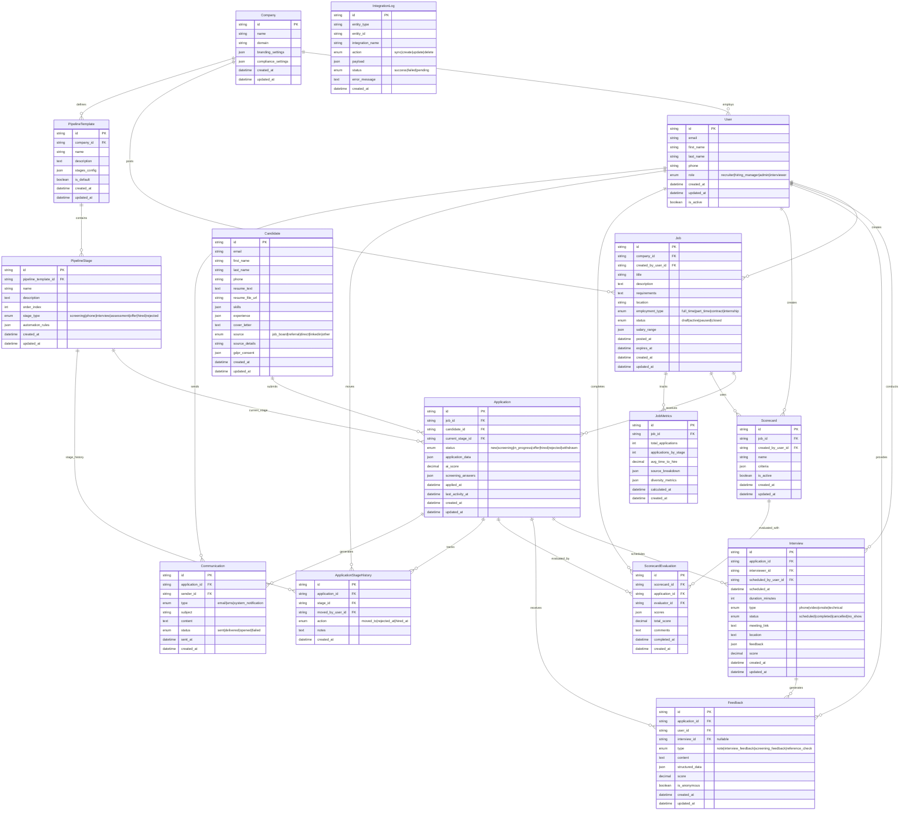

# LTI - A Smarter ATS for Modern Hiring Teams

**LTI** is a next-generation Applicant Tracking System designed for speed, simplicity, and fairness. Built for fast-growing companies and modern hiring teams, LTI removes friction from recruitment while empowering collaboration, intelligent screening, and diversity-conscious hiring.

---

## 🚀 Added Value

- **Intelligent automation** that streamlines repetitive tasks.
- **Bias-reducing tools** that promote fairer hiring.
- **Zero-friction UX** for both candidates and hiring teams.
- **Fast deployment** and seamless integrations with your existing stack.

---

## 🏆 Competitive Advantages

| Feature Area            | LTI Advantage                                           |
| ----------------------- | ------------------------------------------------------- |
| **Candidate Screening** | Skills-first matching engine with explainable AI.       |
| **Collaboration**       | Real-time feedback, async review, Slack-native.         |
| **DEI & Compliance**    | Built-in bias filters, anonymized reviews, GDPR tools.  |
| **Usability**           | Role-specific UI: recruiter, hiring manager, candidate. |
| **Extensibility**       | Open API and modular architecture.                      |

---

## 🧰 Core Functionalities

- **Job & Pipeline Management**

  - Drag-and-drop hiring pipelines
  - Multi-stage workflows with templates

- **Smart Candidate Screening**

  - AI-powered shortlisting (customizable)
  - Knockout questions and scorecards

- **Collaborative Hiring Tools**

  - Inline notes, mentions, and reminders
  - Interview scheduling with calendar sync

- **Candidate Experience**

  - One-click apply, branded pages
  - Mobile-friendly and accessible UI

- **Reporting & Analytics**

  - Time-to-hire, funnel health, DEI metrics
  - Source effectiveness tracking

- **Compliance & Privacy**
  - GDPR/EEO workflows and consent management
  - Data export, audit logs

---

## 📋 Lean Canvas

<table>
<tr>
<td colspan="2" align="center">

### 🎯 **UNIQUE VALUE PROPOSITION**

**"Hire better, faster, and fairer."**

Modern ATS with intelligent automation, built-in DEI tools, and seamless team collaboration.

</td>
<td rowspan="2" align="center">

### 🚀 **UNFAIR ADVANTAGE**

🔹 **Explainable AI** with skills-first matching  
🔹 **Native DEI** and compliance-first design  
🔹 **Real-time, async collaboration** built into hiring workflow  
🔹 **Slack-native** and modular by design

</td>
<td colspan="2" align="center">

### 👥 **CUSTOMER SEGMENTS**

🏢 **Fast-growing companies**  
💻 **Modern, tech-savvy hiring teams**  
🎯 **HR managers and recruiters**  
🌍 **DEI-conscious organizations**

</td>
</tr>
<tr>
<td align="center">

### ⚡ **KEY METRICS**

📊 Time-to-hire reduction  
📉 Candidate drop-off rates  
🎯 Adoption and engagement per feature  
🌈 DEI compliance and diversity funnel metrics

</td>
<td align="center">

### 💡 **SOLUTION**

🧠 Skills-first, explainable AI screening  
💬 Slack-native, async collaboration tools  
✨ Zero-friction UX for candidates and teams  
🛡️ DEI-first workflows and compliance tools

</td>
<td align="center">

### 🚧 **PROBLEM**

⏱️ Hiring processes are slow and inefficient  
🚫 Unconscious bias negatively impacts DEI goals  
💬 Collaboration between hiring teams is fragmented  
🗿 Legacy ATS tools are clunky and unintuitive

</td>
<td align="center">

### 📈 **CHANNELS**

📝 Inbound marketing (content, SEO, webinars)  
🤝 HR tech partnerships & marketplaces  
📞 Direct sales to startups and scaleups  
🔗 Slack and ATS integration platforms

</td>
</tr>
<tr>
<td colspan="3" align="center">

### 💰 **REVENUE STREAMS**

💳 **Subscription-based SaaS** (tiered by team size/features)  
🔧 **Add-ons** for advanced analytics, integrations, and compliance modules

</td>
<td colspan="2" align="center">

### 💸 **COST STRUCTURE**

⚙️ Product development (engineering, AI)  
🎧 Customer support and onboarding  
📢 Marketing and sales  
🔒 Infrastructure and data compliance (e.g., GDPR)

</td>
</tr>
</table>

## 📝 Use cases

Based on the LTI ATS documentation, here are the 3 principal use cases:

### 1. **🤖 Intelligent Candidate Screening & Matching**

This use case focuses on automating and improving the initial candidate evaluation process through AI-powered screening that reduces bias and focuses on skills-first matching.

### 2. **🤝 Collaborative Hiring & Team Coordination**

This use case addresses the need for seamless collaboration between hiring team members through real-time feedback, async reviews, and integrated communication tools.

### 3. **🌈 DEI-Focused Hiring & Compliance Management**

This use case centers on promoting fair hiring practices through built-in bias reduction tools, anonymized reviews, and comprehensive compliance tracking.These three use cases represent the core value propositions of LTI:

## 🗄️ Data model

## 🏗️ High level Design

The high level architecture is define in [system-architecture.md](system-architecture.md)

## 🔍 Skills matching service C4 diagrams

### Context Diagram

### Container Diagram

### Component Diagram

### Code Diagram

