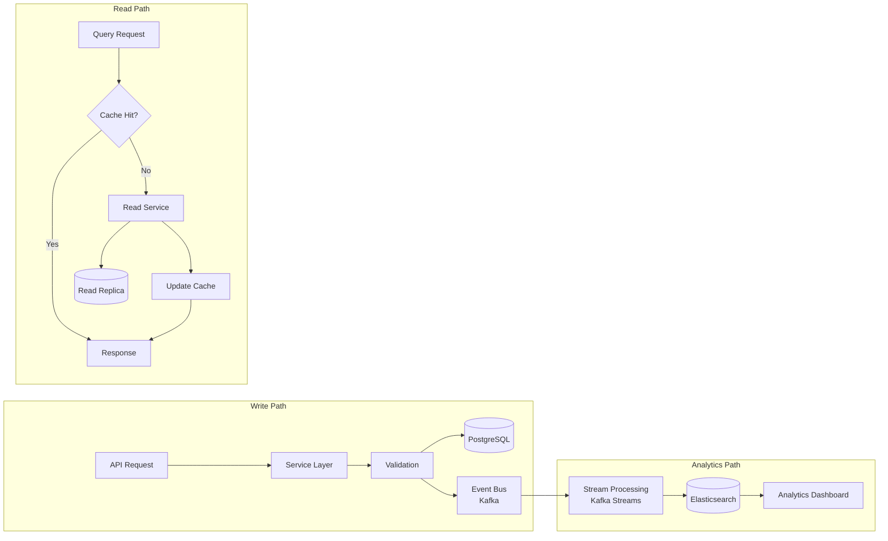
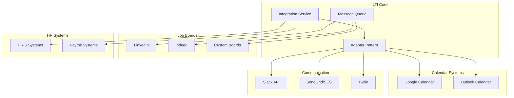
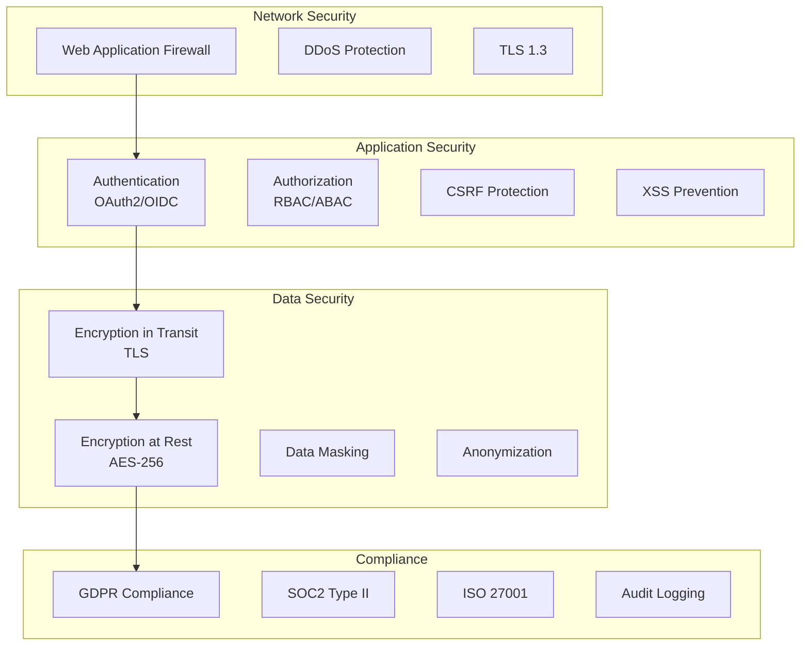
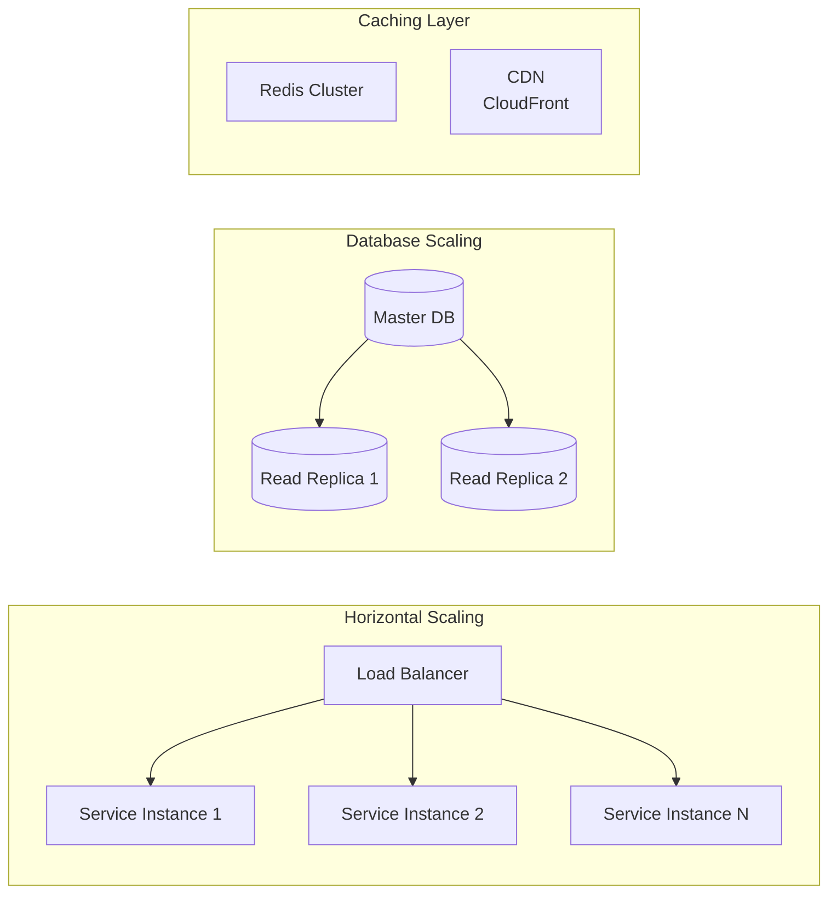
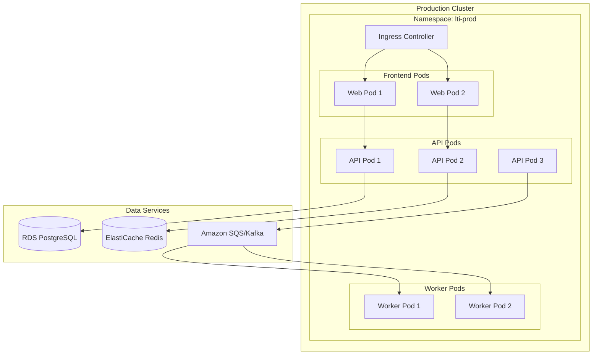
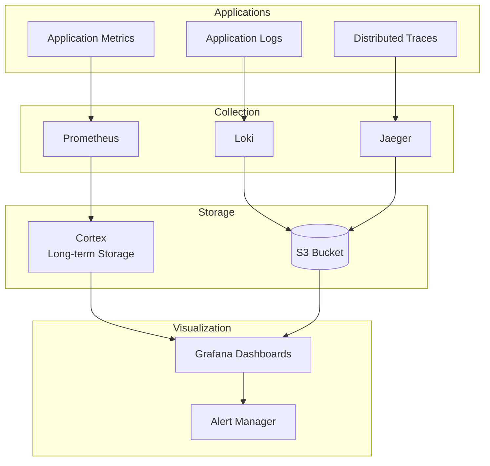

# LTI ATS - High-Level System Architecture

## 🏗️ Architecture Overview

The LTI ATS is designed as a modern, cloud-native application built on microservices architecture principles. The system emphasizes scalability, maintainability, and security while delivering real-time collaboration features and AI-powered capabilities.

### Key Architectural Decisions:

- **Microservices Architecture**: For independent scaling and deployment
- **Event-Driven Architecture**: For real-time updates and async processing
- **API-First Design**: All functionality exposed through well-documented APIs
- **Cloud-Native**: Built for containerization and orchestration
- **CQRS Pattern**: Separate read/write models for optimal performance
- **Domain-Driven Design**: Clear bounded contexts for each service

---

## 🎯 Architecture Principles

1. **Modularity & Loose Coupling**

   - Services communicate through well-defined APIs
   - Each service owns its data and domain logic

2. **Security by Design**

   - Zero-trust security model
   - Data encryption at rest and in transit
   - GDPR/compliance built into the architecture

3. **Scalability First**

   - Horizontal scaling for all services
   - Stateless services where possible
   - Efficient caching strategies

4. **Observability**

   - Comprehensive logging and monitoring
   - Distributed tracing
   - Real-time metrics and alerting

5. **Developer Experience**
   - Self-documenting APIs
   - Consistent patterns across services
   - Local development environment support

---

## 🏛️ System Architecture Diagram

```mermaid
graph TB
    %% Client Layer
    subgraph "Client Layer"
        WEB[Web Application<br/>React/Next.js]
        MOBILE[Mobile Apps<br/>React Native]
        SLACK[Slack Integration]
    end

    %% API Gateway
    subgraph "API Layer"
        GATEWAY[API Gateway<br/>Kong/AWS API Gateway]
        AUTH[Auth Service<br/>OAuth2/JWT]
    end

    %% Core Services
    subgraph "Core Microservices"
        USER[User Service]
        JOB[Job Service]
        CANDIDATE[Candidate Service]
        APPLICATION[Application Service]
        PIPELINE[Pipeline Service]
        INTERVIEW[Interview Service]
        COMM[Communication Service]
        ANALYTICS[Analytics Service]
    end

    %% AI/ML Services
    subgraph "AI/ML Services"
        AI_SCREEN[AI Screening Service]
        AI_MATCH[Skills Matching Service]
        AI_BIAS[Bias Detection Service]
        ML_PIPE[ML Pipeline<br/>Kubeflow/Airflow]
    end

    %% Integration Services
    subgraph "Integration Layer"
        CALENDAR[Calendar Integration<br/>Google/Outlook]
        EMAIL[Email Service<br/>SendGrid]
        STORAGE[File Storage<br/>S3/GCS]
        SEARCH[Search Service<br/>Elasticsearch]
    end

    %% Data Layer
    subgraph "Data Layer"
        POSTGRES[(PostgreSQL<br/>Primary DB)]
        REDIS[(Redis<br/>Cache & Sessions)]
        S3[(S3/GCS<br/>File Storage)]
        ES[(Elasticsearch<br/>Search & Analytics)]
        KAFKA[Apache Kafka<br/>Event Streaming]
    end

    %% Monitoring & Operations
    subgraph "Operations"
        MONITOR[Monitoring<br/>Prometheus/Grafana]
        LOG[Logging<br/>ELK Stack]
        TRACE[Tracing<br/>Jaeger]
    end

    %% Connections
    WEB --> GATEWAY
    MOBILE --> GATEWAY
    SLACK --> GATEWAY

    GATEWAY --> AUTH
    AUTH --> USER

    GATEWAY --> USER
    GATEWAY --> JOB
    GATEWAY --> CANDIDATE
    GATEWAY --> APPLICATION
    GATEWAY --> PIPELINE
    GATEWAY --> INTERVIEW
    GATEWAY --> COMM
    GATEWAY --> ANALYTICS

    APPLICATION --> AI_SCREEN
    APPLICATION --> AI_MATCH
    APPLICATION --> AI_BIAS

    INTERVIEW --> CALENDAR
    COMM --> EMAIL
    CANDIDATE --> STORAGE

    USER --> POSTGRES
    JOB --> POSTGRES
    CANDIDATE --> POSTGRES
    APPLICATION --> POSTGRES
    PIPELINE --> POSTGRES
    INTERVIEW --> POSTGRES

    USER --> REDIS
    APPLICATION --> REDIS

    CANDIDATE --> S3
    JOB --> ES
    CANDIDATE --> ES
    ANALYTICS --> ES

    %% Event streaming
    USER -.-> KAFKA
    JOB -.-> KAFKA
    APPLICATION -.-> KAFKA
    INTERVIEW -.-> KAFKA
    KAFKA -.-> ANALYTICS
    KAFKA -.-> COMM

    %% Monitoring connections
    USER -.-> MONITOR
    JOB -.-> MONITOR
    APPLICATION -.-> MONITOR
    MONITOR --> LOG
    MONITOR --> TRACE
```

---

## 🔧 Service Architecture

### Core Services

#### 1. **User Service**

- **Responsibilities**: User authentication, authorization, profile management
- **Key Features**:
  - Multi-tenancy support
  - Role-based access control (RBAC)
  - SSO integration
- **Database**: PostgreSQL (users, roles, permissions)
- **Cache**: Redis (sessions, permissions)

#### 2. **Job Service**

- **Responsibilities**: Job posting management, pipeline templates
- **Key Features**:
  - Job creation and publishing
  - Pipeline stage configuration
  - Job analytics
- **Database**: PostgreSQL (jobs, pipelines)
- **Search**: Elasticsearch (job search)

#### 3. **Candidate Service**

- **Responsibilities**: Candidate profile management, resume parsing
- **Key Features**:
  - Resume parsing and storage
  - Candidate deduplication
  - GDPR compliance tools
- **Database**: PostgreSQL (candidates)
- **Storage**: S3/GCS (resumes, documents)

#### 4. **Application Service**

- **Responsibilities**: Application lifecycle management
- **Key Features**:
  - Application tracking
  - Stage transitions
  - Screening workflows
- **Database**: PostgreSQL (applications, history)
- **Events**: Kafka (application events)

#### 5. **Pipeline Service**

- **Responsibilities**: Hiring pipeline orchestration
- **Key Features**:
  - Drag-and-drop pipeline builder
  - Automation rules engine
  - Stage transition logic
- **Database**: PostgreSQL (pipeline templates, stages)

#### 6. **Interview Service**

- **Responsibilities**: Interview scheduling and management
- **Key Features**:
  - Calendar integration
  - Automated scheduling
  - Video interview links
- **Database**: PostgreSQL (interviews, availability)
- **Integration**: Google Calendar, Outlook

#### 7. **Communication Service**

- **Responsibilities**: All candidate and team communications
- **Key Features**:
  - Email templates
  - SMS notifications
  - Slack integration
- **Database**: PostgreSQL (communication logs)
- **Queue**: Kafka (async messaging)

#### 8. **Analytics Service**

- **Responsibilities**: Reporting and analytics
- **Key Features**:
  - Real-time dashboards
  - DEI metrics
  - Custom reports
- **Database**: Elasticsearch (analytics data)
- **Processing**: Apache Spark (batch analytics)

### AI/ML Services

#### 1. **AI Screening Service**

- **Responsibilities**: Intelligent candidate screening
- **Key Features**:
  - Resume parsing with NLP
  - Skill extraction
  - Scoring algorithms
- **ML Framework**: TensorFlow/PyTorch
- **Infrastructure**: Kubernetes Jobs

#### 2. **Skills Matching Service**

- **Responsibilities**: Job-candidate matching
- **Key Features**:
  - Semantic similarity matching
  - Experience level assessment
  - Explainable AI results
- **ML Models**: BERT-based models
- **Vector DB**: Pinecone/Weaviate

#### 3. **Bias Detection Service**

- **Responsibilities**: DEI compliance and bias reduction
- **Key Features**:
  - Resume anonymization
  - Bias pattern detection
  - Fair ranking algorithms
- **ML Framework**: Fairlearn, AI Fairness 360

---

## 💻 Technology Stack

### Frontend

- **Web Application**: React 18+ with Next.js 14
- **Mobile Apps**: React Native
- **UI Framework**: Material-UI / Tailwind CSS
- **State Management**: Redux Toolkit / Zustand
- **Real-time**: Socket.io / WebSockets

### Backend

- **Primary Language**: Node.js (TypeScript) / Python (AI services)
- **API Framework**: NestJS / FastAPI
- **Authentication**: Auth0 / Keycloak
- **API Gateway**: Kong / AWS API Gateway

### Databases

- **Primary Database**: PostgreSQL 15+
- **Cache**: Redis 7+
- **Search**: Elasticsearch 8+
- **Vector Database**: Pinecone / Weaviate
- **File Storage**: AWS S3 / Google Cloud Storage

### Infrastructure

- **Container**: Docker
- **Orchestration**: Kubernetes (EKS/GKE)
- **Service Mesh**: Istio
- **CI/CD**: GitLab CI / GitHub Actions
- **IaC**: Terraform

### Monitoring & Operations

- **Metrics**: Prometheus + Grafana
- **Logging**: ELK Stack (Elasticsearch, Logstash, Kibana)
- **Tracing**: Jaeger
- **APM**: DataDog / New Relic

### AI/ML Infrastructure

- **ML Framework**: TensorFlow / PyTorch
- **ML Pipeline**: Kubeflow / MLflow
- **Model Serving**: TensorFlow Serving / TorchServe
- **Feature Store**: Feast

---

## 🗄️ Data Architecture

### Data Flow Pattern

### Data Partitioning Strategy

- **By Company**: Multi-tenant data isolation
- **By Date**: Historical data archival
- **By Region**: GDPR compliance

### Caching Strategy

- **Session Data**: Redis with 24h TTL
- **User Permissions**: Redis with 1h TTL
- **Job Listings**: Redis with 5m TTL
- **Search Results**: Elasticsearch with built-in caching

---

## 🔌 Integration Architecture

### External Integrations

### Integration Patterns

- **Webhook-based**: Real-time event notifications
- **Polling**: For systems without webhook support
- **Batch Sync**: Nightly data synchronization
- **API Gateway**: Centralized integration management

---

## 🔒 Security Architecture

### Security Layers

### Security Best Practices

1. **Zero Trust Architecture**
2. **Principle of Least Privilege**
3. **Defense in Depth**
4. **Regular Security Audits**
5. **Automated Vulnerability Scanning**

---

## 🚀 Scalability & Performance

### Scaling Strategies

### Performance Optimization

- **Database Indexing**: Strategic indexes on frequently queried fields
- **Query Optimization**: EXPLAIN analysis and query tuning
- **Connection Pooling**: Optimal database connection management
- **Async Processing**: Background jobs for heavy operations
- **CDN**: Static asset delivery
- **API Response Caching**: Redis-based API caching

### Performance Targets

- **API Response Time**: < 200ms (p95)
- **Page Load Time**: < 2s
- **Availability**: 99.9% uptime
- **Concurrent Users**: 10,000+
- **RPS**: 1,000+ requests per second

---

## 🚢 Deployment Architecture

### Kubernetes Deployment

### CI/CD Pipeline

```mermaid
graph LR
    DEV[Developer] --> GIT[Git Push]
    GIT --> CI[CI Pipeline]
    CI --> TEST[Automated Tests]
    TEST --> BUILD[Build Docker Images]
    BUILD --> SCAN[Security Scan]
    SCAN --> REG[Container Registry]
    REG --> CD[CD Pipeline]
    CD --> STAGE[Staging Deploy]
    STAGE --> E2E[E2E Tests]
    E2E --> PROD[Production Deploy]
    PROD --> MONITOR[Monitoring]
```

### Environment Strategy

- **Development**: Local Docker Compose
- **Staging**: Kubernetes namespace with production-like config
- **Production**: Multi-region Kubernetes clusters
- **DR**: Hot standby in secondary region

---

## 📊 Monitoring & Observability

### Observability Stack

### Key Metrics

- **Business Metrics**: Applications/day, Time-to-hire, Conversion rates
- **Technical Metrics**: Response time, Error rate, Throughput
- **Infrastructure Metrics**: CPU, Memory, Disk, Network
- **User Experience**: Page load time, API latency, Error rates

---

## 🔄 Disaster Recovery

### DR Strategy

- **RTO**: 1 hour
- **RPO**: 15 minutes
- **Backup Strategy**:
  - Database: Continuous replication + daily snapshots
  - Files: Cross-region S3 replication
  - Configuration: GitOps with version control

### Failover Process

1. Health check failure detection
2. Automated DNS failover
3. Database promotion in secondary region
4. Cache warming
5. Service verification
6. Traffic gradual shift

---

## 📝 Summary

The LTI ATS architecture is designed to be:

- **Scalable**: Handle growth from startup to enterprise
- **Maintainable**: Clear service boundaries and documentation
- **Secure**: Defense in depth with compliance built-in
- **Performant**: Sub-second response times
- **Resilient**: High availability with disaster recovery
- **Modern**: Cloud-native with latest technologies

This architecture provides a solid foundation for building a next-generation ATS that can evolve with changing business needs while maintaining high performance and reliability.
